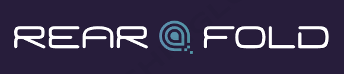

<h1 align="center">RearFold AI</h1>

<p align="center">
  
</p>

<p align="center">
    kaejong2</a><sup>1*</sup> &emsp;&emsp;
    Nega0619</a><sup>2*</sup> &emsp;&emsp;
</p>

<p align="center">
    <a href="https://github.com/snuailab-biz/ison-dev">Demo</a>
</p>

---

## Progress
- [x] 📣 Initialize RFai
- [ ] 📣 YOLOv8 inference Class modulation **highly!**
- [ ] 📣 Set API Type
- [ ] 📣 BentoML **highly!**
- [ ] Docker image for BentoML
- [ ] Release

---
## Install
기본적으로 Docker docker-nvidia는 설치되어 있어야 한다.
중요한 설치 항목으로는 pytorch, ultralytics가 있으며 본인 환경에 맞춰서 설치를 하시길 바랍니다.
```
python -m venv venv
source venv/bin/activate
pip install -r requirements.txt
```
<p align="center">
    <a href="https://github.com/snuailab-biz/ison-dev/blob/main/docs/environment.md">Install</a>
</p>

## Usage
CLI를 통해 실행하여 정상적으로 동작하는지 확인한 후 docker image build를 진행하시기 바랍니다.
### CLI
```
python bento_packer.py
bentoml serve rfai_service:svc -p {your_port}
```


### Docker
```
python bento_packer.py
bentoml build
bentoml containerize yolov8s_svc:latest
docker run -it -d --rm --gpus="device=0" -p 3000:3000 yolov8s_svc:latest serve
```
<p align="center">
    <a href="https://github.com/snuailab-biz/ison-dev/blob/main/docs/excutable_guide.md">Usage</a>
</p>

## BentoML FLow
1. 모델 학습 코드 생성
2. Prediction Service Class 생성
3. Prediction Service에 모델 저장(Pack)
4. (Local) Serving 후 테스트
5. Docker Image Build(컨테이너화)
6. Serving 배포
